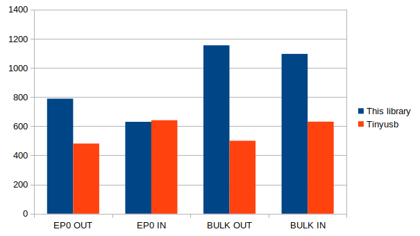

# USB device library for RP2040

A fast and lightweight USB device library:

- Packets: Control, bulk, isochronous and interrupt.
- Up to 1.1MBps (8.8Mbps). See [Tinyusb comparison](#tinyusb-comparison).
- Up to 32 endpoints.
- Double buffered.
- Interrupt driven.

It is compatible with the [SDK](https://raspberrypi.github.io/pico-sdk-doxygen/) and [Arduino](https://github.com/earlephilhower/arduino-pico).

## Limitations

- No USB host. If needed USB host, use Tinyusb library.  
- USB classes not implemented. Implement the class yourself or use Tinyusb lbrary.   
- Isochronous packet size 1024 cant be used, as maximum size for RP2040 is 1023. This is a HW limitation (issue?).  

## Usage

How to use it:

- Add *usb.h, usb.c, usb_common.h, usb_config.h and usb_config.c* to your project. 
- If using SDK, add the required libraries (pico_stdlib, hardware_irq) to your CMakeLists.txt. See [CMakeLists.txt](src/CMakeLists.txt)
- Modify *usb_config.h* and *usb_config.c* to configure endpoints, handlers and buffers. Do not modify EP0 endpoints.   
- Use bInterval to adjust polling rate. 0 default, 1 fastest, 16 slowest.  
- If endpoint *data_buffer* is NULL, endpoint callback is called every *wMaxPacketSize* to read/write the buffer. This allows data streaming. If is not NULL *data_buffer*, endpoint callback is called at the end of transfer.  
- If transfer size is *UNKNOWN_SIZE*, transfer continues until short packet is received or, if sending, when transfer is cancelled.  

### Functions:  

**void usb_device_init(void)**

Init usb as device.  
\
**void usb_init_transfer(struct usb_endpoint_configuration \*ep, uint32_t len)**

Starts a transfer.

- If the the endpoint buffer is *null*, it raises an interrupt for every packet to read/send data. Otherwise it completes the transfer to len and raises and the endpoint interrput when completed. This does not apply to EP0.  
- If *len* is *UNKNOWN_SIZE*, it sends packets indefinitely. It is raised the endpoint interrupt for every packet to read/send data. This does not apply to EP0.    

Parameters:  
&nbsp;&nbsp;**ep** - endpoint  
&nbsp;&nbsp;**len** - transfer lenght  
\
**void usb_continue_transfer(struct usb_endpoint_configuration \*ep)**

Continues a transfer.  

Parameters:  
&nbsp;&nbsp;**ep** - endpoint  
\
**bool usb_is_transfer_completed(struct usb_endpoint_configuration \*ep)**

Returns true if a transfer is completed.  

Parameters:  
&nbsp;&nbsp;**ep** - endpoint  
\
**void usb_cancel_transfer(struct usb_endpoint_configuration \*ep)**

Cancels a transfer.  

Parameters:  
&nbsp;&nbsp;**ep** - endpoint  
\
**struct usb_endpoint_configuration \*usb_get_endpoint_configuration(uint8_t addr)**

Returns a pointer to the endpoint.  

Parameters:  
&nbsp;&nbsp;**ep** - endpoint  
\
**bool usb_is_configured(void)**

Returns true if the device is configured.  
\
**uint8_t usb_get_address(void)**

Returns the device address.  

## Tinyusb comparison

Comparing output values from [usb_speed_test.py](utils/usb_speed_test.py) for both implementations, this library versus Tinyusb (as of [09/17/2024](https://github.com/hathach/tinyusb/tree/f4dd1764849d005a2e44d51f62428aeaf2513804)), we get the following results:

<p align="center"><br>  

### This library
```
Request REQ_EP0_OUT. Size: 4096 bytes. Speed: 789 kBs
Request REQ_EP0_IN. Size: 4096 bytes. Speed: 630 kBs
Request REQ_EP1_OUT. Size: 30000 bytes. Speed: 1155 kBs
Request REQ_EP2_IN. Size: 30000 bytes. Speed: 1096 kBs
```
### Tinyusb
```
Request REQ_EP0_OUT. Size: 4096 bytes. Speed: 481 kBs
Request REQ_EP0_IN. Size: 4096 bytes. Speed: 641 kBs
Request REQ_EP1_OUT. Size: 30000 bytes. Speed: 500 kBs
Request REQ_EP2_IN. Size: 30000 bytes. Speed: 631 kBs
```
### Conclusion
```
EP0 OUT: +64.03 %
EP0 IN: -1.72 %
BULK OUT 131.10 %
BULK IN: 73.69 %
```
This library outperforms significantly Tinyusb for BULK and EP0 OUT. Isochronous and interrupt transfers are not supported by Tinyusb.  

For this linbrary isochronous transfers `(bInterval=1, wMaxPacketSize=512)` maximum speed is 480kBs and interrupt transfers `(bInterval=1, wMaxPacketSize=64)` 62kBs.  

## References

- [RP2040 datasheet](https://datasheets.raspberrypi.com/rp2040/rp2040-datasheet.pdf)
- [RP2040 SDK](https://raspberrypi.github.io/pico-sdk-doxygen/)
- [Example dev_lowlevel](https://github.com/raspberrypi/pico-examples/tree/master/usb/device/dev_lowlevel)
- [USB in a nutshell](https://www.beyondlogic.org/usbnutshell/usb1.shtml)