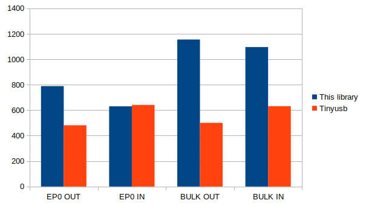

# USB Device Library for RP2040

A fast and lightweight USB device library for the RP2040.

## Features

- Supports control, bulk, isochronous, and interrupt transfers
- Up to 1.1 MB/s (8.8 Mb/s). See [TinyUSB comparison](#tinyusb-comparison).
- Supports up to 32 endpoints
- Supports double buffering
- Interrupt-driven

Compatible with the [Raspberry Pi Pico SDK](https://raspberrypi.github.io/pico-sdk-doxygen/).

## Usage

To use the library:

- Add `usb.h`, `usb.c`, `usb_common.h`, `usb_config.h`, and `usb_config.c` to your project.
- Add the required libraries (`pico_stdlib`, `hardware_irq`) to your `CMakeLists.txt`. See [`src/CMakeLists.txt`](src/CMakeLists.txt).
- Configure endpoints, handlers, and buffers in `usb_config.h` and `usb_config.c`. Do not modify the EP0 endpoints.
- Use `bInterval` to adjust the polling interval: `0` = default, `1` = fastest, `16` = slowest.
- If `data_buffer` is `NULL`, the endpoint callback is called for every `wMaxPacketSize` packet so the application can read or write data incrementally. This allows streaming. If `data_buffer` is not `NULL`, the callback is called when the transfer completes.
- If the transfer size is `UNKNOWN_SIZE`, the transfer continues until a short packet is received or, for IN transfers, until the transfer is cancelled.
- Isochronous packet size 1024 cannot be used, because the RP2040 hardware limit is 1023 bytes.
- `wMaxPacketSize` must be a multiple of 64.
- Double buffering can be used with `wMaxPacketSize` values of 64, 128, 256, and 512. Sizes 128, 256, and 512 are supported only for isochronous transfers.
- For maximum bulk transfer speed, use `double_buffer = true` and `bInterval = 1`.
- For maximum isochronous transfer speed, use `double_buffer = false`, `bInterval = 1`, and `wMaxPacketSize = 960`.

## API

### `void usb_device_init(void)`

Initializes the USB peripheral in device mode.

### `void usb_init_transfer(struct usb_endpoint_configuration *ep, uint32_t len)`

Starts a transfer.

- If the endpoint buffer is `NULL`, an interrupt is generated for every packet so the application can read or write data incrementally. Otherwise, the transfer continues until `len` bytes have been transferred, and the endpoint interrupt is raised once the transfer completes. This does not apply to EP0.
- If `len` is `UNKNOWN_SIZE`, packets are sent or received continuously until a short packet is received or the transfer is cancelled. This does not apply to EP0.

Parameters:  
`ep` - endpoint configuration  
`len` - transfer length

### `void usb_continue_transfer(struct usb_endpoint_configuration *ep)`

Continues a transfer.

Parameters:  
`ep` - endpoint configuration

### `bool usb_is_transfer_completed(struct usb_endpoint_configuration *ep)`

Returns `true` if the transfer has completed.

Parameters:  
`ep` - endpoint configuration

### `void usb_cancel_transfer(struct usb_endpoint_configuration *ep)`

Cancels a transfer.

Parameters:  
`ep` - endpoint configuration

### `struct usb_endpoint_configuration *usb_get_endpoint_configuration(uint8_t addr)`

Returns a pointer to the endpoint configuration for the specified endpoint address.

Parameters:  
`addr` - endpoint address

### `bool usb_is_configured(void)`

Returns `true` if the device has been configured by the host.

### `uint8_t usb_get_address(void)`

Returns the current USB device address.

## Callback Functions

### `void control_transfer_handler(uint8_t *buf, volatile struct usb_setup_packet *pkt, uint8_t stage)`

Called when a setup packet is received on EP0. It is invoked in three stages: setup, data, and status.

Parameters:  
`buf` - EP0 data buffer  
`pkt` - setup packet  
`stage` - `STAGE_SETUP`, `STAGE_DATA`, or `STAGE_STATUS`

### `void ep_handler(uint8_t *buf, uint16_t len)`

Called at the end of a transfer for buffered endpoints, or once per `wMaxPacketSize` packet when streaming.

Parameters:  
`buf` - buffer to read from or write to  
`len` - number of valid data bytes

## TinyUSB Comparison

Comparing the output of [`usb_speed_test.py`](utils/usb_speed_test.py) for both implementations, this library and TinyUSB (commit dated [2024-09-17](https://github.com/hathach/tinyusb/tree/f4dd1764849d005a2e44d51f62428aeaf2513804)), the following results were obtained:

<p align="center"><br></p>

### This library

```text
Request REQ_EP0_OUT. Size: 4096 bytes. Speed: 789 kB/s
Request REQ_EP0_IN. Size: 4096 bytes. Speed: 630 kB/s
Request REQ_EP1_OUT. Size: 30000 bytes. Speed: 1155 kB/s
Request REQ_EP2_IN. Size: 30000 bytes. Speed: 1096 kB/s
```

### TinyUSB

```text
Request REQ_EP0_OUT. Size: 4096 bytes. Speed: 481 kB/s
Request REQ_EP0_IN. Size: 4096 bytes. Speed: 641 kB/s
Request REQ_EP1_OUT. Size: 30000 bytes. Speed: 500 kB/s
Request REQ_EP2_IN. Size: 30000 bytes. Speed: 631 kB/s
```

### Conclusion

```text
EP0 OUT:   +64.03%
EP0 IN:    -1.72%
BULK OUT: +131.10%
BULK IN:   +73.69%
```

In this benchmark, the library outperforms TinyUSB for bulk transfers and EP0 OUT transfers. Isochronous and interrupt transfers are not supported by TinyUSB.

## Limitations

- USB host mode is not supported. If you need host support, use TinyUSB.
- USB classes are not implemented. You must implement the class yourself or use TinyUSB.
- Only one configuration and one interface are currently supported.

## References

- [RP2040 Datasheet](https://datasheets.raspberrypi.com/rp2040/rp2040-datasheet.pdf)
- [RP2040 SDK](https://raspberrypi.github.io/pico-sdk-doxygen/)
- [Example: dev_lowlevel](https://github.com/raspberrypi/pico-examples/tree/master/usb/device/dev_lowlevel)
- [USB in a Nutshell](https://www.beyondlogic.org/usbnutshell/usb1.shtml)
